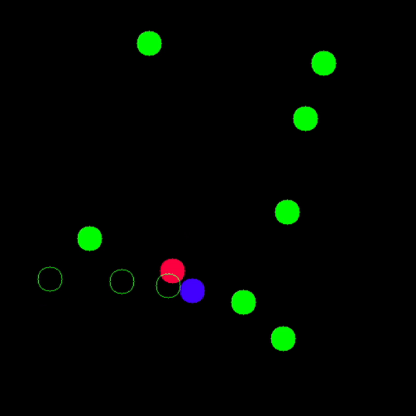

# ml_tutorial

# self supervised learning

- example for MNIST noisy images clustering
- run notebok [ssl/ssl_training.ipynb](ssl/ssl_training.ipynb)

# reinforcement learning

- example for PPO RL Cart balancing 
- run notebok [ppo_rl/ppo_rl_training.ipynb](ppo_rl/rl_training.ipynb)

# installation 

- install requirements : numpy torch torchvision gymnasium 'gymnasium[box2d]'
